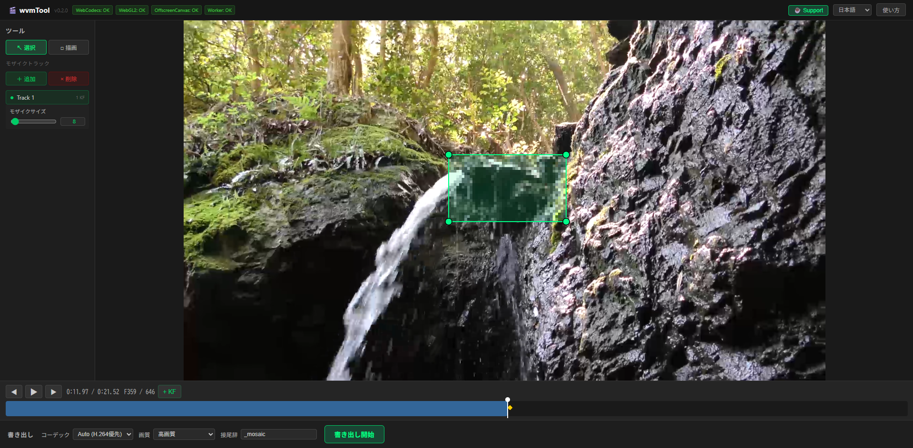

# wvmTool

[日本語](README.md) | [English](README.en.md) | [中文](README.zh.md) | [한국어](README.ko.md) | [Español](README.es.md) | [Français](README.fr.md)



브라우저 완결형 동영상 모자이크 편집 웹 앱입니다.

## 다음 URL에서 사용 가능

https://dikmri.github.io/wvmTool/

## 지원 브라우저

- Google 크롬 최신 버전 (권장)
- Microsoft Edge 최신 버전
- Firefox 최신 버전
- Safari: 일부 기능이 제한될 수 있습니다(WebCodecs/WebGL2 호환성)

## 주요 기능

- MP4 동영상 드래그 앤 드롭 로드
- 여러 사각형 모자이크 트랙을 독립적으로 관리
- 모자이크 범위의 그리기, 이동, 코너 핸들에 의한 리사이즈
- 모자이크 범위 회전(Q/E 키, R로 리셋)
- 키프레임 기반 모자이크 위치, 크기, 회전, 표시/숨기기 애니메이션
- WebGL2에 의한 실시간 모자이크 프리뷰(회전 대응)
- WebCodecs를 통한 고속 프레임 디코딩/인코딩
- 음성 첨부 MP4 내보내기(원 동영상의 비트레이트를 자동 인계)
- 재생 중에는 오버레이 테두리를 숨기고 순수한 모자이크 확인이 가능
- 화면의 "사용법"버튼에서 바로 가기 목록을 표시합니다.
- **다국어 대응**: 일본어 / English / 중문 / 한국어 / Español / Français (헤더로 전환)

## 사용법

1. MP4 동영상을 뷰포트에 드래그 앤 드롭(또는 클릭하여 파일 선택)
2. 도구 패널에서 + 추가를 클릭하여 모자이크 트랙 만들기
- 추가하면 자동으로 그리기 모드로 전환
3. 뷰포트에서 드래그하여 모자이크 범위를 그립니다.
4. 타임라인을 탐색하면서 필요한 위치에 키프레임 추가(K 키)
5. 필요에 따라 선택 모드로 전환하고, 직사각형을 드래그하여 이동·코너 핸들로 리사이즈
6. 내보내기 패널에서 내보내기 시작을 클릭합니다.

### 모자이크 트랙 조작

- **여러 트랙**: 트랙을 여러 개 추가하면 각각 독립적인 모자이크 영역이 있습니다.
- **●/○ 버튼**: 트랙 활성화/비활성화
- **× 삭제**: 선택한 트랙 삭제
- **모자이크 크기**: 슬라이더로 모자이크의 입도 조정(5~80px)

### 키보드 단축키

| 키 | 조작 |
|------|------|
| Space | 재생/정지 |
| ArrowLeft | 1 프레임 뒤로 |
| ArrowRight | 1 프레임 앞으로 |
| Shift+← / → | 첫 번째 / 마지막 프레임으로 이동 |
| K | 현재 위치에 키프레임 추가 |
| Delete | 선택한 키프레임 삭제 |
| Q | 모자이크 범위를 반시계 방향으로 5°회전 |
| E | 모자이크 범위를 시계 방향으로 5° 회전 |
| R | 모자이크 범위 회전 재설정(0°) |
| H | 모자이크 표시 / 숨기기를 키 프레임으로 기록 |
| I | 새로운 모자이크 트랙 추가 |
| N | 디스플레이 크기를 화면에 맞추기(줌 리셋) |
| 휠 | 디스플레이 확대 / 축소 |

> 재생 중에는 모자이크 범위의 테두리가 숨겨지고 모자이크 효과 만 확인할 수 있습니다.

### 내보내기 설정

| 설정 | 내용 |
|------|------|
| 코덱 | Auto (H.264 우선) / H.264 / VP9 / AV1 |
| 화질 | 최고 화질(quantizer 16) / 고화질(22) / 표준(28) / 저화질(35). 기본값은 "고화질" |
| 접미사 | 출력 파일 이름에 추가할 문자열(기본값: `_mosaic`) |

H.264는 VBR (Variable Bitrate)로 품질을 제어합니다. 원본 동영상의 비트 전송률을 자동으로 감지하고 품질 설정의 승수를 곱하여 대상 비트 전송률을 결정합니다(고화질=원 동영상과 동등, 최고 화질=1.5배, 표준=0.65배, 저화질=0.35배). FPS는 원래 동영상에서 자동 감지. 오디오는 원본 동영상에서 통과됩니다.

모자이크 트랙을 추가하고 드로잉 모드에서 사각형을 그리면 드로잉이 완료된 후 자동으로 선택 모드로 전환됩니다. 모자이크 범위는 동영상 범위 밖에서도 지정할 수 있습니다.

## 개인 정보 보호

**동영상 파일은 서버에 업로드되지 않습니다. ** 모든 처리는 사용자의 브라우저 내에서 완료됩니다. 외부 API에 대한 통신은 일절하지 않습니다.

## 알려진 제한

- Safari에서는 WebCodecs / WebGL2의 대응 상황에 따라 일부 기능이 제한됩니다.
- 매우 긴 고해상도 동영상에서는 메모리가 부족할 수 있습니다.
- 내보내려면 브라우저의 WebCodecs API가 필요합니다.

## 기술 구성

| 레이어 | 기술 |
|----------|------|
| UI 프레임워크 | Svelte 5+ TypeScript |
| 빌드 도구 | Vite 6 |
| 비디오 디코딩 / 인코딩 | WebCodecs API |
| 렌더링 | WebGL2 (회전 가능 모자이크 셰이더) |
| Canvas2D 폴백 | WebGL2 비대응 환경용(회전 대응) |
| 백그라운드 처리 | Web Worker + OffscreenCanvas |
| MP4 컨테이너 분석 | mp4box.js |
| MP4 멀티플렉스 | mp4-muxer |
| 호스팅 | GitHub Pages |

## 실적 정책

- UI 스레드에 동영상 프레임 데이터를 가질 수 없음
- 무거운 처리(디코드 인코딩 모자이크 적용)는 모두 Web Worker에서 실행
- WebGL2 쉐이더에 의한 GPU 모자이크 처리(최대 8트랙 동시)
- OffscreenCanvas를 사용하여 메인 스레드에 미치는 영향 최소화
- VideoFrame은 사용 후에 항상 `close()` 하여 메모리 누수를 방지
- 내보낼 때는 모든 프레임을 유지하지 않고 순차 처리

## 개발 방법

```bash
# 依存関係のインストール
npm install

# 開発サーバー起動
npm run dev

# プロダクションビルド
npm run build

# ビルドのプレビュー
npm run preview
```

## 배포 방법

`main` 브랜치로의 push 로 GitHub Actions 가 자동적으로 빌드 해 GitHub Pages 에 배치합니다.

수동 배포의 경우:

```bash
npm run build
# dist/ ディレクトリの内容を GitHub Pages にデプロイ
```
